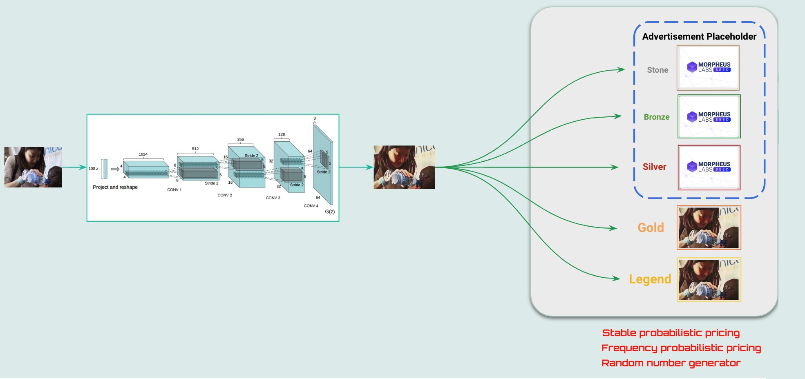

# ChariTree

#### [Web 3 Sandbox – Hackathon](https://www.morpheuslabs.io/hackathon-2022/)

 

---

#### Problem Statement

[How NFTs Could Be Used For Building Philanthropic Communities?](https://www.morpheuslabs.io/how-nfts-could-be-used-for-building-philanthropic-communities/)

Build the next generation of philanthropic experiences by connecting NFT/ metaverse based applications with In real life (IRL) businesses and brands. 

Illustrate how it can create more engagement opportunity to increase visibility and traction to help the foundation with achieving its mission” 

#### Pitch Deck

Link : [https://docs.google.com/presentation/d/1VtcJDiX6Tv4zqPHn6A29To3t3rgi1RD9eechS0jjalc/edit?usp=sharing](https://docs.google.com/presentation/d/1VtcJDiX6Tv4zqPHn6A29To3t3rgi1RD9eechS0jjalc/edit?usp=sharing)

 

#### Demo Video

Link : [https://drive.google.com/file/d/1M17REN8bKsOcBr4-Zb1uLnzGmgOfWW9d/view?usp=sharing]( https://drive.google.com/file/d/1M17REN8bKsOcBr4-Zb1uLnzGmgOfWW9d/view?usp=sharing)

---

#### Website Service

 

\* <u>The details shown above are for demostration purpose, not real.</u>

#### Opensea Collection

 

---

#### Architecture

 

#### User Flow

 

#### Philanthropic NFT

 

#### Mechanism

 

